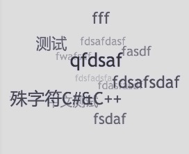

#Hexo Tag Cloud

[](https://badge.fury.io/js/hexo-tag-cloud)
[中文说明版本](https://github.com/MikeCoder/hexo-tag-cloud/blob/master/README.ZH.md)

Tag Cloud for Hexo

##How it looks like


And you can see online live demo by clicking [here](http://mikecoder.github.io)

##How to use
+ go into your hexo system folder, and add depandence `"hexo-tag-cloud": "2.0.*"` to `package.json`
+ then do *npm install* command
+ then you need to change your theme layout file
+ for example, in its default theme landscape, we should find `hexo/themes/landscape/layout/_widget/tagcloud.ejs`
+ then we change the file to the following code:
```
<% if (site.tags.length){ %>
    <script type="text/javascript" charset="utf-8" src="/js/tagcloud.js"></script>
    <script type="text/javascript" charset="utf-8" src="/js/tagcanvas.js"></script>
    <div class="widget-wrap">
        <h3 class="widget-title"><%= __('tagcloud') %></h3>
        <div id="myCanvasContainer" class="widget tagcloud">
            <canvas width="250" height="250" id="resCanvas" style="width=100%">
                <%- tagcloud() %>
            </canvas>
        </div>
    </div>
<% } %>
```
+ then we have finished the plugin install and configuration. And you can write and deploy as usual, it will create tagcloud auto. Enjoy your hexo.

##Troubleshooting
Submit issue please

##Customize
Now the hexo-tag-cloud plugin support customize feature. It's simple to change the color and the font for the tag cloud.

+ Add these config below to your *_config.yml* file(which under your blog root directory)
```
# hexo-tag-cloud
tag_cloud:
    textFont: Trebuchet MS, Helvetica
    textColour: #333
    textHeight: 25
    outlineColour: #E2E1D1
```
+ then use `hexo c && hexo g && hexo s` to enjoy your different tag cloud

##TODO
See [Todo.md](./TODO.md)

#Thanks
+ **[TagCanvas](http://www.goat1000.com/tagcanvas.php)**
